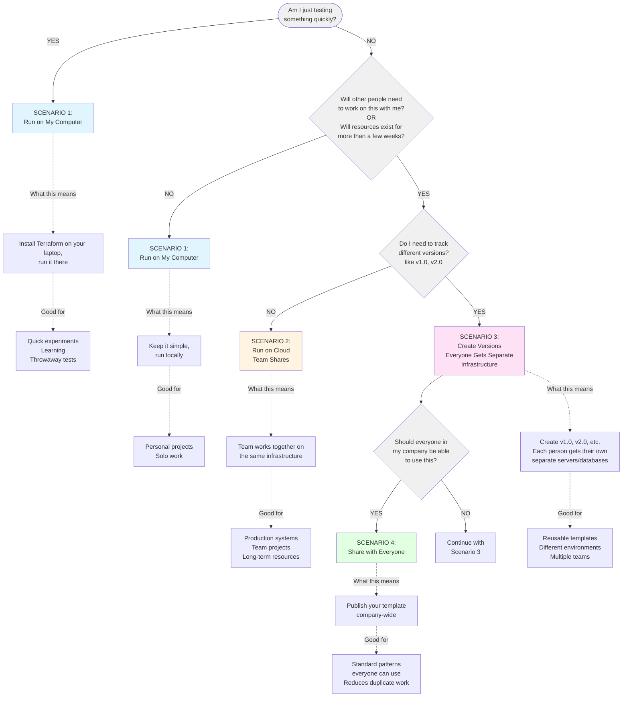

# Terraform Deployment Decision Guide

## Skill Overview
This skill helps Terraform template owners decide where to run their templates by evaluating the advantages and disadvantages of local versus cloud-based execution.

## Purpose
Guide template owners through a decision-making process to select the optimal deployment approach based on their specific requirements, constraints, and objectives.

## Decision Framework

### Quick Decision Framework

#### Your Journey Path
```
┌─────────────┐    ┌─────────────┐    ┌─────────────┐    ┌─────────────┐
│ SCENARIO 1  │ ──>│ SCENARIO 2  │ ──>│ SCENARIO 3  │ ──>│ SCENARIO 4  │
│   START     │    │    GROW     │    │    SCALE    │    │    SHARE    │
└─────────────┘    └─────────────┘    └─────────────┘    └─────────────┘
  Run on My          Run on Cloud      Create Versions    Share with
  Computer           (Team Shares)     (Separate Infra)   Everyone
```

#### Quick Lookup: Which Scenario Am I?

| ✓ Check Your Situation | → Your Scenario | What This Means |
|------------------------|-----------------|-----------------|
| Just testing quickly | **Scenario 1** | Run Terraform on your laptop |
| Solo work, short-term | **Scenario 1** | Keep it simple, run locally |
| Team collaboration needed | **Scenario 2** | Team works on same infrastructure together |
| Resources exist long-term (>few weeks) | **Scenario 2** | Cloud-based, protected state file |
| Need version tracking (v1.0, v2.0) | **Scenario 3** | Each deployment creates new infrastructure |
| Multiple teams need separate copies | **Scenario 3** | Everyone gets their own servers/databases |
| Template useful company-wide | **Scenario 4** | Publish globally (requires Scenario 3 first) |

**Simple Terms Guide:**
- **Scenario 1: Run on My Computer** = I run Terraform on my laptop/desktop
- **Scenario 2: Run on Cloud (Team Shares)** = My team runs Terraform in the cloud, we all work on the same infrastructure
- **Scenario 3: Create Versions (Everyone Gets Separate Infrastructure)** = Create numbered versions, each person who deploys gets their own separate servers/databases
- **Scenario 4: Share with Everyone** = Make my template available to the whole company (requires Scenario 3 first)

```
START: Am I just testing something quickly?
│
├─ YES → SCENARIO 1: Run on My Computer
│         What this means: Install Terraform on your laptop, run it there
│         Good for: Quick experiments, learning, throwaway tests
│         ⚠️  Warning: Only you can manage these resources
│
└─ NO → Will other people need to work on this with me?
         OR will these resources exist for more than a few weeks?
    │
    ├─ YES → Do I need to track different versions (like v1.0, v2.0)?
    │   │
    │   ├─ NO → SCENARIO 2: Run on Cloud (Team Shares)
    │   │         What this means: Team works together on the same infrastructure
    │   │         Good for: Production systems, team projects, long-term resources
    │   │         ✓ Everyone manages the same servers/databases together
    │   │
    │   └─ YES → SCENARIO 3: Create Versions (Everyone Gets Separate Infrastructure)
    │             What this means: Create v1.0, v2.0, etc. Each person who deploys gets their own separate servers/databases
    │             Good for: Reusable templates, different environments, multiple teams
    │             ✓ Track versions, everyone gets their own independent infrastructure
    │
    │             Later, ask yourself: Should everyone in my company be able to use this?
    │             │
    │             └─ YES → SCENARIO 4: Share with Everyone
    │                       What this means: Publish your template company-wide
    │                       Good for: Standard patterns everyone can use
    │                       ✓ Company-wide access, reduces duplicate work
    │
    └─ NO → SCENARIO 1: Run on My Computer
              What this means: Keep it simple, run locally
              Good for: Personal projects, solo work
```

**In Plain English:**
- **Scenario 1 vs 2**: My computer vs Cloud (where does it run?)
- **Scenario 2 vs 3**: Team shares same infrastructure vs Everyone gets their own separate infrastructure
- **Scenario 3 vs 4**: Private to my team vs Available to whole company

**Important:** You must do Scenario 3 before you can do Scenario 4 - you can't share something company-wide until you've created the versioned template first.

### Visual Flowchart



## Detailed Comparison

### Local Terraform Execution

#### Advantages
✅ **Minimal Setup**
- No cloud account configuration needed
- No repository setup required
- Immediate execution capability
- Zero additional infrastructure

✅ **Fast Iteration**
- Instant code changes
- No commit/push cycle
- Direct testing feedback
- Rapid debugging

✅ **Development Flexibility**
- Experiment freely
- Test breaking changes safely
- No impact on others
- Complete control

✅ **Cost Efficiency**
- No Schematics service costs
- No repository hosting fees
- Pay only for created resources
- Minimal overhead

✅ **Privacy**
- Code stays on local machine
- No external dependencies
- Complete isolation
- Sensitive data contained

#### Disadvantages
❌ **Single User Limitation**
- Only you can manage resources
- No team collaboration possible
- Knowledge locked to one person
- Bus factor of 1

❌ **State File Risk**
- Vulnerable to machine failure
- Risk of accidental deletion
- No automatic backups
- Corruption possible

❌ **No Disaster Recovery**
- Lost machine = lost state
- No redundancy
- Manual backup required
- Recovery difficult

❌ **Limited Scalability**
- Cannot handle team growth
- No concurrent operations
- Single point of failure
- Difficult to hand off

❌ **No Audit Trail**
- Changes not tracked
- No approval workflow
- Limited accountability
- Compliance challenges

#### Best For
- Template development and testing
- Learning Terraform
- Proof of concepts
- Short-lived resources (< 1 week)
- Personal projects
- Rapid prototyping

#### Avoid When
- Resources will exist > 1 month
- Team collaboration needed
- Production environments
- Compliance requirements exist
- Business-critical infrastructure
- Multiple people need access

### Cloud-Based Terraform (Schematics)

#### Advantages
✅ **Team Collaboration**
- Multiple users can manage resources
- Shared state file access
- Collective maintenance
- Knowledge distribution

✅ **State File Protection**
- Cloud-backed storage
- Automatic backups
- Disaster recovery built-in
- Corruption protection

✅ **Reliability**
- Survives local machine failures
- No single point of failure
- High availability
- Enterprise-grade storage

✅ **Access Control**
- IAM-based permissions
- Role-based access
- Audit logging
- Compliance support

✅ **Version Control Integration**
- Git repository required
- Change tracking automatic
- Code review possible
- Rollback capability

✅ **Scalability**
- Handle large deployments
- Concurrent operations
- Team growth supported
- Enterprise-ready

#### Disadvantages
❌ **Setup Complexity**
- Git repository required
- Cloud account needed
- IAM configuration necessary
- Learning curve exists

❌ **Slower Iteration**
- Commit/push cycle required
- Workspace update needed
- Additional steps involved
- More time per change

❌ **Cost Overhead**
- Repository hosting costs (if private)
- Potential Schematics costs
- Cloud storage fees
- Management overhead

❌ **Network Dependency**
- Internet connection required
- Cloud service availability
- Potential latency
- Connectivity issues possible

❌ **Less Privacy**
- Code in repository
- State in cloud
- Logs in cloud
- More exposure points

#### Best For
- Team collaboration
- Long-term resources (> 1 month)
- Production environments
- Business-critical infrastructure
- Compliance requirements
- Shared resource management

#### Avoid When
- Quick testing only
- Single user sufficient
- No internet access
- Extreme privacy needs
- Learning/experimentation
- Disposable resources

## Decision Criteria Matrix

### Evaluate Your Situation

| Criterion | Local | Cloud | Weight |
|-----------|-------|-------|--------|
| **Team Size** | | | |
| Single user | ✅ Excellent | ⚠️ Overkill | High |
| 2-5 users | ❌ Poor | ✅ Excellent | High |
| 5+ users | ❌ Impossible | ✅ Excellent | High |
| **Resource Lifetime** | | | |
| < 1 day | ✅ Perfect | ⚠️ Overkill | Medium |
| 1 day - 1 week | ✅ Good | ⚠️ Optional | Medium |
| 1 week - 1 month | ⚠️ Risky | ✅ Good | High |
| > 1 month | ❌ Dangerous | ✅ Required | Critical |
| **Environment Type** | | | |
| Development | ✅ Good | ✅ Good | Low |
| Testing | ⚠️ Acceptable | ✅ Better | Medium |
| Staging | ❌ Poor | ✅ Required | High |
| Production | ❌ Never | ✅ Required | Critical |
| **Collaboration Need** | | | |
| None | ✅ Perfect | ⚠️ Overkill | High |
| Occasional | ❌ Difficult | ✅ Good | High |
| Frequent | ❌ Impossible | ✅ Required | Critical |
| **Risk Tolerance** | | | |
| High | ✅ Acceptable | ⚠️ Optional | Medium |
| Medium | ⚠️ Risky | ✅ Better | High |
| Low | ❌ Unacceptable | ✅ Required | Critical |
| **Compliance** | | | |
| None | ✅ Fine | ✅ Fine | Low |
| Internal policies | ⚠️ Check | ✅ Better | Medium |
| Regulatory | ❌ Likely fails | ✅ Required | Critical |

### Scoring Guide
- Count your ✅ (Excellent/Perfect/Required) = 3 points
- Count your ✅ (Good/Better) = 2 points
- Count your ⚠️ (Acceptable/Optional) = 1 point
- Count your ❌ (Poor/Dangerous/Never) = 0 points

**If Local score > Cloud score**: Start with local, plan migration
**If Cloud score > Local score**: Use cloud from the start
**If scores are close**: Consider hybrid approach

## Hybrid Approach

### Development → Production Pipeline

**Phase 1: Local Development**
```
Develop locally → Test quickly → Iterate rapidly
```
- Use local Terraform for initial development
- Fast feedback loop
- Experiment freely

**Phase 2: Cloud Migration**
```
Commit to Git → Create Schematics workspace → Deploy to cloud
```
- Move to cloud when ready for team/production
- Import or recreate resources
- Establish team workflow

**Phase 3: Production Management**
```
Manage via Schematics → Collaborate with team → Maintain long-term
```
- All production changes via cloud
- Team collaboration enabled
- State file protected

### Best of Both Worlds
1. **Develop locally** for speed and flexibility
2. **Test in cloud** for validation
3. **Deploy to cloud** for production
4. **Maintain in cloud** for reliability

## Migration Strategies

### From Local to Cloud

#### Strategy 1: Fresh Start (Recommended)
1. Commit template to Git
2. Create Schematics workspace
3. Deploy new resources
4. Migrate workloads
5. Destroy local resources

**Pros**: Clean state, no complications
**Cons**: Requires workload migration

#### Strategy 2: State Import
1. Commit template to Git
2. Create Schematics workspace
3. Import existing state file
4. Verify state accuracy
5. Continue management in cloud

**Pros**: Keep existing resources
**Cons**: Complex, error-prone

#### Strategy 3: Parallel Management
1. Keep local resources running
2. Create cloud resources separately
3. Gradually migrate workloads
4. Decommission local resources
5. Complete transition

**Pros**: Zero downtime
**Cons**: Temporary duplication costs

## Real-World Scenarios

### Scenario 1: Solo Developer Testing
**Situation**: Testing new Terraform module
**Recommendation**: Local
**Reasoning**: Quick iteration needed, disposable resources, no collaboration

### Scenario 2: Team Building Shared Infrastructure
**Situation**: 5 developers building company VPC
**Recommendation**: Cloud
**Reasoning**: Team collaboration essential, long-term resources, production-bound

### Scenario 3: Learning Terraform
**Situation**: Individual learning Terraform basics
**Recommendation**: Local
**Reasoning**: Experimentation needed, frequent changes, short-lived resources

### Scenario 4: Production Database Cluster
**Situation**: Deploying production database
**Recommendation**: Cloud
**Reasoning**: Business-critical, team management, disaster recovery needed

### Scenario 5: Proof of Concept
**Situation**: Testing feasibility of new architecture
**Recommendation**: Local → Cloud
**Reasoning**: Start local for speed, move to cloud if approved

### Scenario 6: Multi-Environment Deployment
**Situation**: Dev, staging, and production environments
**Recommendation**: Cloud
**Reasoning**: Multiple environments, team access, compliance requirements

## Common Mistakes to Avoid

### ❌ Using Local for Production
**Problem**: State file loss causes production outage
**Solution**: Always use cloud for production

### ❌ Using Cloud for Quick Tests
**Problem**: Overhead slows development
**Solution**: Use local for rapid iteration

### ❌ No Migration Plan
**Problem**: Stuck with local when team grows
**Solution**: Plan cloud migration from start

### ❌ Ignoring State File Backups
**Problem**: Lost state file, unmanaged resources
**Solution**: Backup local state or use cloud

### ❌ Mixing Local and Cloud
**Problem**: State file conflicts, resource drift
**Solution**: Choose one approach per template

## Decision Checklist

Use this checklist to make your decision:

### Choose LOCAL if:
- [ ] Single user only
- [ ] Resources exist < 1 week
- [ ] Rapid iteration needed
- [ ] Learning/experimenting
- [ ] No compliance requirements
- [ ] Disposable infrastructure
- [ ] Development/testing only

### Choose CLOUD if:
- [ ] Multiple users need access
- [ ] Resources exist > 1 month
- [ ] Production environment
- [ ] Team collaboration needed
- [ ] Compliance requirements exist
- [ ] Business-critical infrastructure
- [ ] Disaster recovery needed
- [ ] Audit trail required

### Consider HYBRID if:
- [ ] Development phase → production
- [ ] Testing locally, deploying to cloud
- [ ] Learning before production use
- [ ] Prototyping before team adoption

## Next Steps

### If You Chose Local
1. Review: `local-terraform-management.md`
2. Set up local Terraform
3. Plan cloud migration timeline
4. Document state file location

### If You Chose Cloud
1. Review: `cloud-schematics-terraform.md`
2. Create Git repository
3. Set up IBM Cloud account
4. Create Schematics workspace

### If You Chose Hybrid
1. Start with local development
2. Review both skill documents
3. Plan migration trigger points
4. Prepare Git repository

## Getting Help

### Questions to Ask
1. How long will these resources exist?
2. Who needs to manage them?
3. What's the risk if state file is lost?
4. Are there compliance requirements?
5. Is this development or production?
6. How often will changes occur?
7. What's the team size?

### Decision Support
If still unsure, consider:
- **Default to cloud** if any doubt about longevity
- **Start local** only if certain about short-term use
- **Consult team** for shared infrastructure decisions
- **Review compliance** requirements before deciding

## Summary

### The Golden Rules
1. **Local for speed, Cloud for safety**
2. **Single user = Local, Team = Cloud**
3. **Short-term = Local, Long-term = Cloud**
4. **Development = Flexible, Production = Cloud**
5. **When in doubt, choose Cloud**

### Remember
- You can always migrate from local to cloud
- Migrating from cloud to local is rarely needed
- The right choice depends on your specific situation
- Consider future needs, not just current state
- State file protection is critical for long-term resources